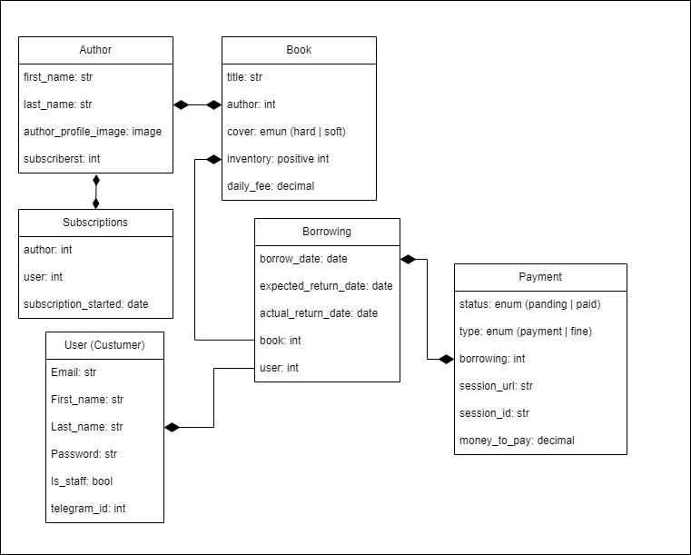

# Library API 📚
##### DRF Team Project
The goal of this project is to implement an online management system for book borrowing. This system will streamline the library's administrative processes and greatly improve the user experience.

## 📍 Features

### **_Functional_** :

* Web-based
* Manage books inventory
* Manage books borrowing
* Manage customers
* Display notifications
* Handle payments
### **_Non-functional_** :
* 5 concurrent users
* Up to 1000 books
* 50k borrowings/year
* ~30MB/year


## ⚙️ Installation

1. Python3 must be already installed.

   ```shell
   git clone https://github.com/lgSilay/library-service-project.git
   cd library-service-project
   python3 -m venv venv
   source venv/bin/activate  # On Windows use `venv\Scripts\activate`
   pip install -r requirements.txt
   #create .env file based on env.sample
   python manage.py makemigrations
   python manage.py migrate
   ```
2. Load prepared data:

   ```shell
   python3 manage.py loaddata library_serice_data.json

3. After loading, by default, you will have these users:

   * Admin user: `user1@email.com` 
   * Default users:
      - `user2@email.com`
      - `user3@email.com`
      - `user4@email.com`
      - `user5@email.com`
* Password for any of them: ***GGduIU@***

## 🐳 Run with Docker

[Docker](https://www.docker.com/products/docker-desktop) should be installed.
```shell
docker-compose up --build
```

##  ✅ Accessing the Application

You can now access the API by opening your web browser 
and navigating to http://localhost:8000.

## 🧾 Available urls
#### 📕 _Book Service_
- api/books/books/
- api/books/books/<id>/
- api/books/books/<id>/upload-image/
- api/books/books/?title=...&author-id=...&author-first-name...&author-last-name=...&available&unavailable

- api/books/authors/
- api/books/authors/<id>/
- api/books/authors/<id>/upload-image/
- api/books/authors/<id>/subscribe
- api/books/authors/?books-count=...&books-gt=...&books-lt=...&first-name=...&last-name=...&no-books&has-books

#### 👤 _Users Service_
- api/user/register/
- api/user/token/
- api/user/token/refresh/
- api/user/token/verify/
- api/user/me/
- api/user/telegram

#### 🤝 _Borrowings Service:_
- api/borrowing_service/borrowings/
- api/borrowing_service/borrowings/?user_id=...&is_active=... 
- api/borrowing_service/borrowings/<id>/
- api/borrowing_service/borrowings/<id>/return

#### 💸 _Payments Service_
- api/payments/payments/
- api/payments/payments/<id>/
- api/payments/payments/<id>/renew/
- api/payments/payments/success/
- api/payments/payments/cancel/

#### 📃 _Documentations_
- api/doc/swagger/
- api/doc/redoc/

## 📋 DB structure

